# Iqra — Quran Learning System

Open the Quran. Tap only the words you don’t know. Gradually understand Arabic without leaning on a side-by-side translation.

| | |
| --- | --- |
| **Live app** | [iqra-quran-learning-eight.vercel.app](https://iqra-quran-learning-eight.vercel.app) |
| **Android APK** | [Download Iqra APK](https://iqra-quran-learning-eight.vercel.app/downloads/iqra-quran-learning.apk) |
| **Source** | [github.com/baheesa/iqra-quran-learning](https://github.com/baheesa/iqra-quran-learning) |
| **PDF manual** | [docs/Quran-Learning-System-User-Manual.pdf](docs/Quran-Learning-System-User-Manual.pdf) |
| **In-app help** | [/help](https://iqra-quran-learning-eight.vercel.app/help) |

<p align="center">
  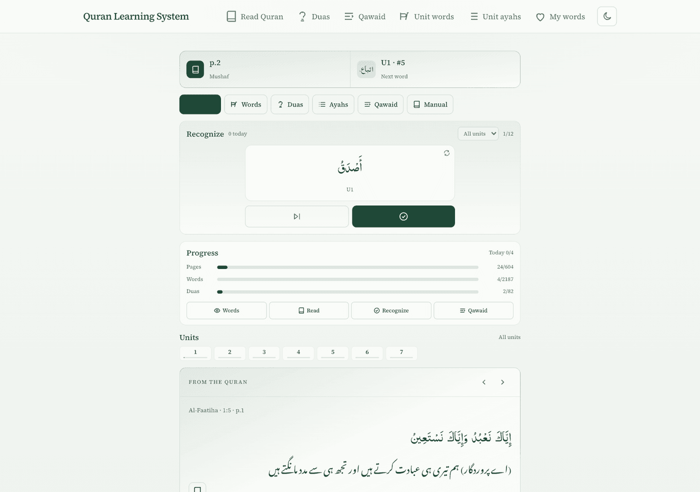
  &nbsp;
  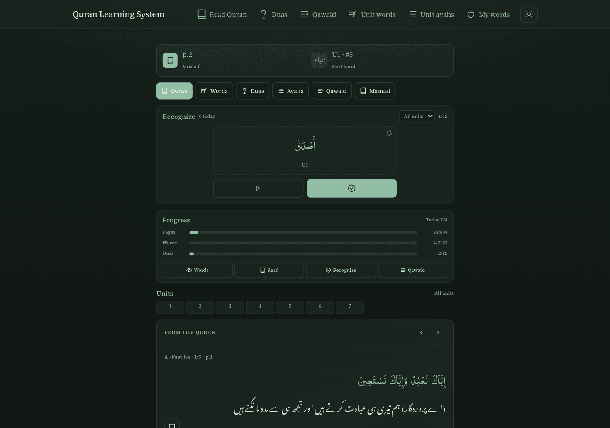
</p>

<p align="center"><em>Light and dark mode — same calm reading surface, easier on the eyes at night.</em></p>

---

## What this app is

Iqra is a **recognition-first** Quran learning companion for Urdu speakers, grounded in **Muallim-ul-Quran** (Units 1–7).

You read the mushaf. When a word is unfamiliar, you tap it for a short Urdu tip. Those words can land in **My words** for later review. Qawaid (rules), unit words, ayahs, and duas sit beside reading — not instead of it.

The goal is simple: open the Quran, read continuously, recognize familiar words, understand verses more naturally, and depend less on translation and less on the app over time.

### What this is not

Not a chatbot. Not a translation app. Not a grammar course. Not a quiz or gamification platform. Not a social network.

The Quran stays at the center. Tips and AI only **help recognition** — they are not the curriculum or the source of truth. Muallim-ul-Quran is.

### Educational order

Reading → Recognition → Understanding → Practice → Reflection → Revision

Grammar appears only when it genuinely helps understanding.

---

## Download for Android

For phone use with **bundled offline data** (mushaf + curriculum on the device):

**[Download Iqra APK](https://iqra-quran-learning-eight.vercel.app/downloads/iqra-quran-learning.apk)**

Also in this repo: [`public/downloads/iqra-quran-learning.apk`](./public/downloads/iqra-quran-learning.apk)

- Allow install from your browser if Android asks.
- No ads. Progress stays on the device.
- Web demo progress uses the browser; the APK is the fully offline companion.

| | Web | Offline APK |
| --- | --- | --- |
| Mushaf + word tips | Yes | Yes (bundled data) |
| Qawaid / duas / units | Yes | Yes |
| Works without internet | Limited (needs server for some APIs) | Yes |

---

## Getting started

1. Open the [live app](https://iqra-quran-learning-eight.vercel.app) or install the [APK](https://iqra-quran-learning-eight.vercel.app/downloads/iqra-quran-learning.apk).
2. Start on **Home** — see progress, resume the mushaf, or practice recognition.
3. Open **Read Quran** and read for about **15–20 minutes**.
4. Tap only words you don’t recognize; useful ones appear under **My words**.
5. Optionally open **Qawaid**, **Unit words**, **Unit ayahs**, or **Duas**.

<p align="center">
  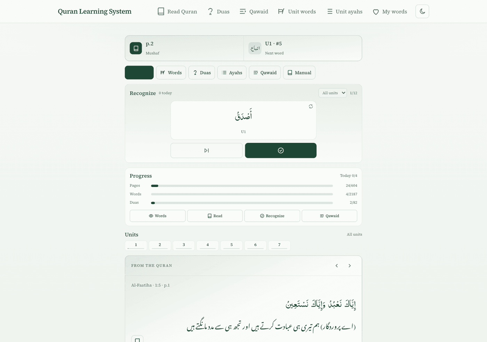
</p>

<p align="center"><em>Home — resume reading, daily recognition, and progress in one place.</em></p>

### Daily habit

1. Open **Quran** and read a page calmly.
2. Tap any word you are unsure about — its **Urdu tip** appears on the word.
3. Mark unit words / ayahs / qawaid as you become familiar.
4. Optionally revise **My words**, **Qawaid**, or a short **dua**.

### Tips for better learning

- Prefer **reading** over collecting tips.
- Use tips to **confirm**, not to replace thinking.
- Return to the same pages until words feel familiar.
- Use Qawaid when a pattern repeats and you want the short rule.

---

## Features

### Quran reader

Indo-Pak script, page / juz / surah navigation, font size, bookmarks, and last-page memory. The mushaf stays uncluttered; tools live in the toolbar.

<p align="center">
  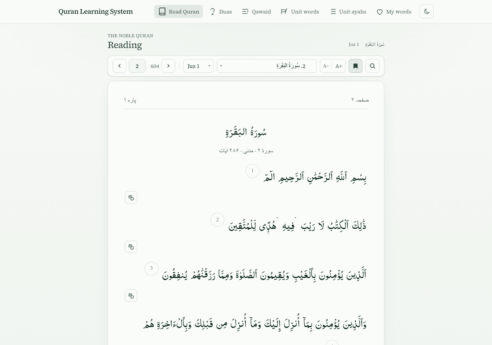
</p>

### Word tip on tap

Tap a word → a short Urdu tip appears on that word. Tap elsewhere to dismiss. Attention stays on the Arabic, not a full translation column. Optional ayah Urdu is available on demand (recognition first, translation second).

<p align="center">
  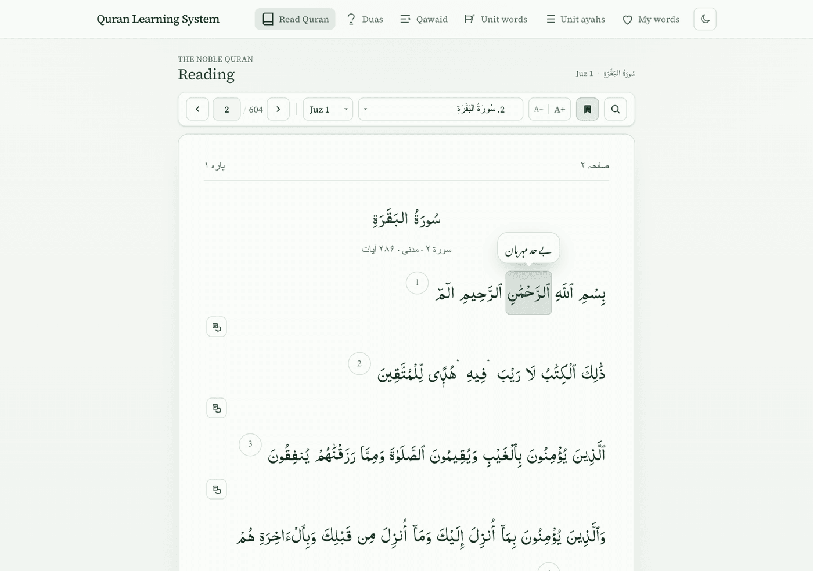
</p>

### My words

Words you tapped while reading become a personal review list — meanings you already met in the mushaf.

<p align="center">
  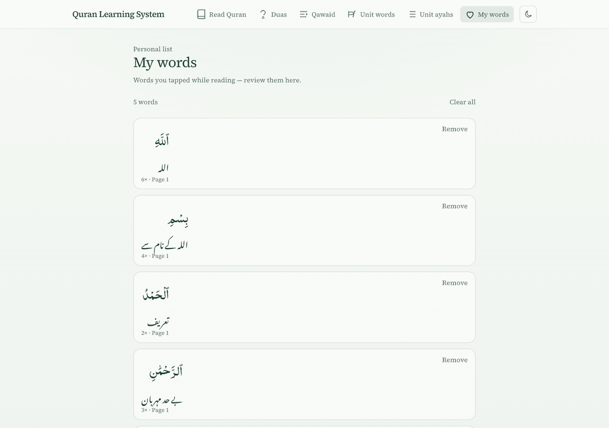
</p>

### Search & view all ayahs

Search in Arabic or Urdu from the reader. Preview matches, then **View all** to browse every listed ayah and jump back into the mushaf with highlight.

<p align="center">
  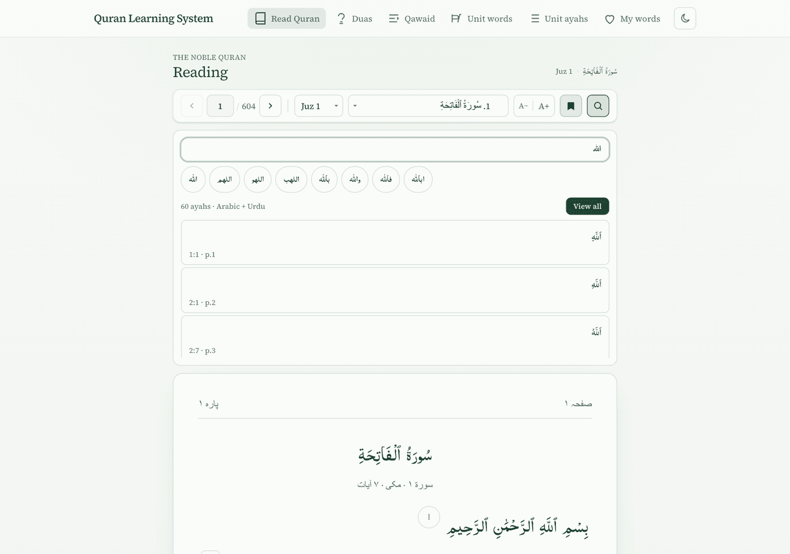
  &nbsp;
  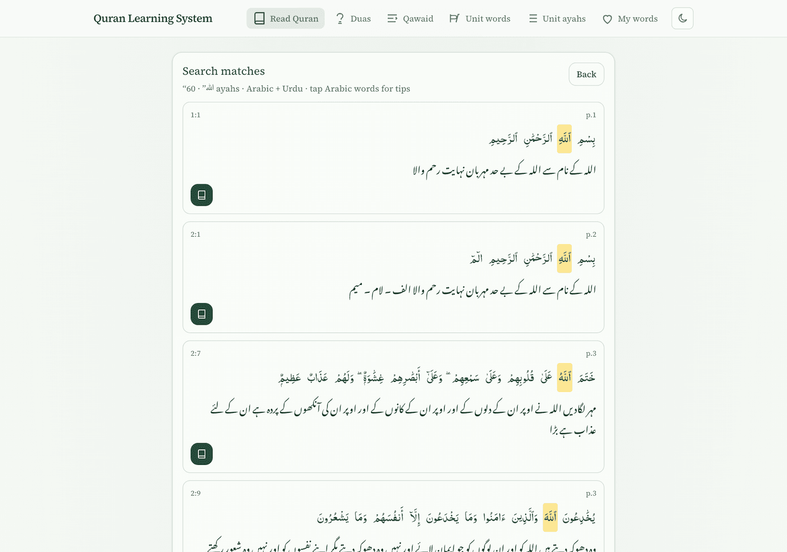
</p>

### Qawaid (rules)

Short patterns from Muallim Units 1–7: title, brief definition, Quran examples. Tap example words for tips when available. Grammar only when it helps recognition.

<p align="center">
  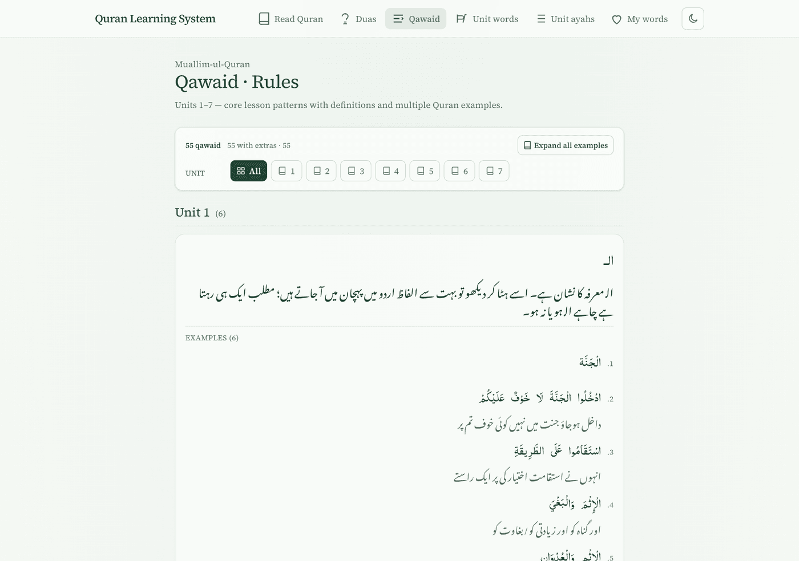
</p>

### Unit words & ayahs

Browse curriculum vocabulary and practice ayahs by unit. Search, mark familiar, open the related mushaf page, tap Arabic for tips.

<p align="center">
  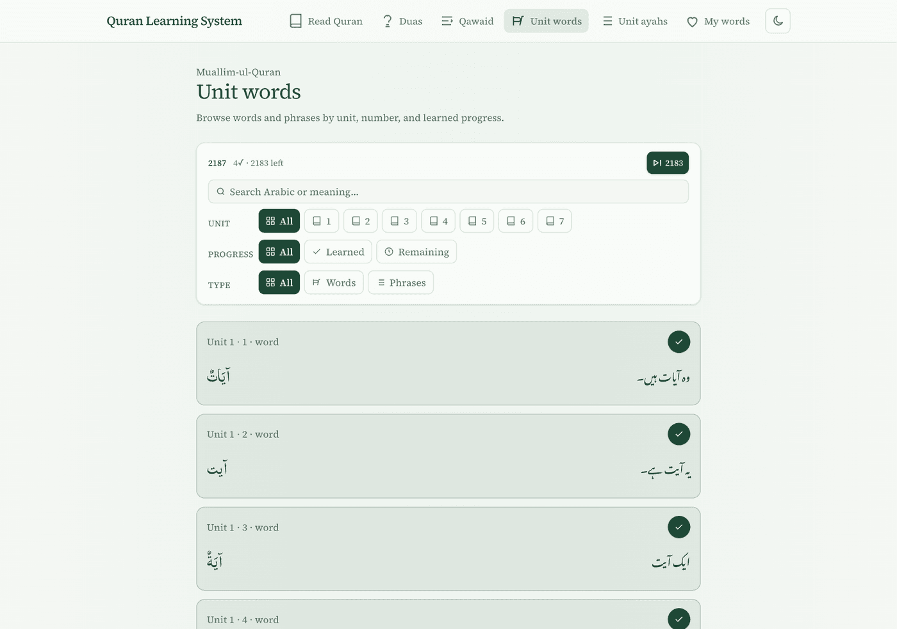
  &nbsp;
  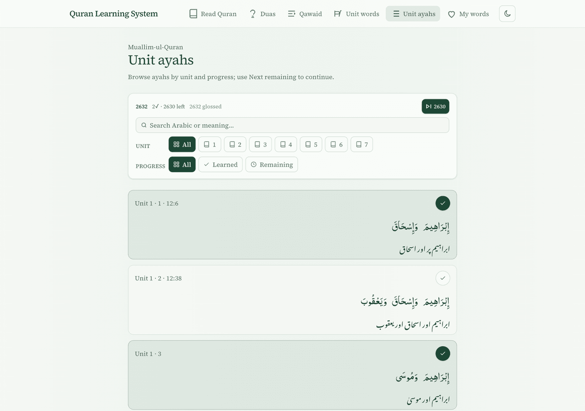
</p>

### Duas

**Daily / masnoon** duas for ordinary moments, and **Qur’anic duas** organized by juz. Qur’anic cards show the **dua excerpt** (not the full surrounding story) with matching Urdu. Mark memorized when you know them; book icon opens the mushaf. Progress appears on Home.

<p align="center">
  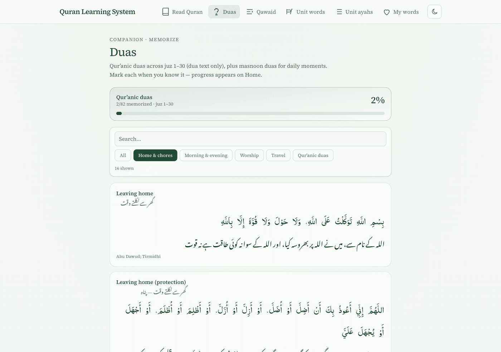
  &nbsp;
  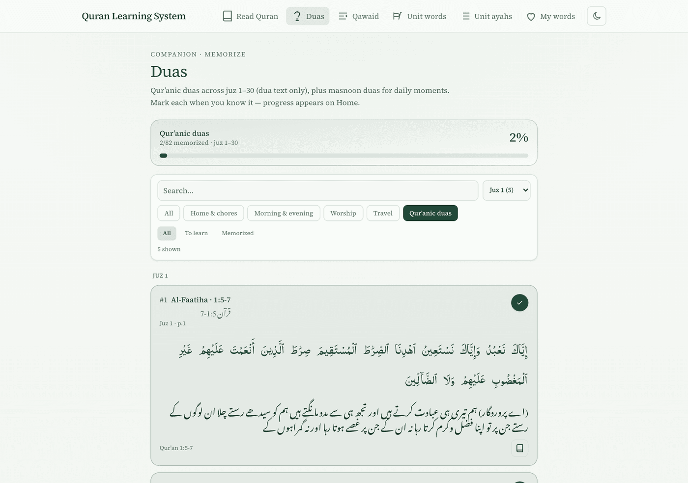
</p>

### Progress on Home

There is no separate quiz dashboard. **Home** is the progress surface: pages visited, unit word/ayah progress, memorized duas, and a short recognition practice.

<p align="center">
  
</p>

### Dark & light mode

Toggle from the header. Choose the mode easiest on your eyes for day or evening reading.

---

## Data (how content is served)

Learner content is **static JSON** under `data/` in the repo — not live Google Sheets.

| Surface | Data source |
| --- | --- |
| Web (Next.js) | Reads `data/` on the server (API routes + pages) |
| Iqra APK | Copies `data/` via `offline-apk/scripts/sync-data.sh` into the install bundle |

Curriculum is distilled from Muallim sources + curated JSON; mushaf / word-by-word / search indexes are build-time artifacts. Static JSON keeps the public demo reliable: no quotas, no broken Sheets links, no secrets for data access.

Optional rebuild scripts (dev only, not needed to run the demo): search index builders, WBW helpers, curriculum export / rule distill scripts under `scripts/`.

Never commit `.env.local` or API keys. Use `.env.example` / `.env.production.example`.

---

## Run locally (web)

```bash
pnpm install
cp .env.example .env.local
pnpm db:generate
pnpm dev
```

Learner demo works with `AUTH_PROVIDER=memory` and no AI keys. See `.env.production.example`.

Open [http://127.0.0.1:3000](http://127.0.0.1:3000). In-app help: [/help](http://127.0.0.1:3000/help).

---

## Build the Android APK yourself

```bash
cd offline-apk
bash scripts/sync-data.sh
npm install
npm run apk:debug
```

Output lands under `offline-apk/dist-apk/`. For the web download button, copy it to:

`public/downloads/iqra-quran-learning.apk`

---

## User manual (PDF)

Polished PDF with screenshots:

**[docs/Quran-Learning-System-User-Manual.pdf](docs/Quran-Learning-System-User-Manual.pdf)**

Regenerate screenshots and the PDF (uses system Chrome; defaults to the live demo):

```bash
pnpm docs:screenshots   # → docs/images/
pnpm docs:manual        # → HTML + PDF
pnpm docs:all           # both
```

Set `DOCS_BASE_URL=http://127.0.0.1:3000` to capture against a local server.

Also see [CASE_STUDY.md](./CASE_STUDY.md) for the portfolio write-up. Architecture notes live under `docs/00`–`docs/31` for contributors; learners only need this README and the PDF.

---

## Tech stack

Next.js 15 · React 19 · TypeScript · Tailwind CSS · Prisma · pnpm · Capacitor (APK) · static JSON under `data/` · Vercel

UI language defaults: Urdu · Jameel Noori Nastaleeq · Indo-Pak Quran script.

---

## License

Educational use.
